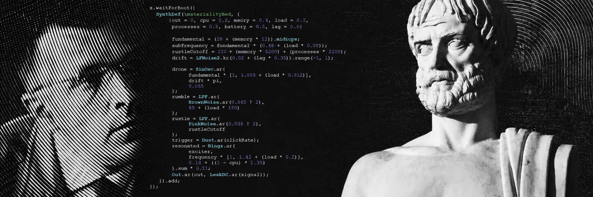

# Materialität am Übergang



A process-based composition in which a laptop listens to its own internal
activity and turns the conditions of computation into sound.

The original idea behind this project belongs to my very dear friend and
colleague [Luis Küffner](https://luiskueffner.com), whose bachelor's report
[*Materialität am Übergang*](https://www.researchgate.net/publication/413987749_Materialitat_am_Ubergang_Individuieren_einer_kompositorischen_Praxis) provides its theoretical and
artistic point of departure.

In this work, Küffner reflects on a broader understanding of composition.
Rather than reducing a work to material placed under a pre-existing form, he
understands it as an evolving constellation of all the forces involved in its
becoming: material properties and resistance, formal decisions, technical
systems, temporal processes, perception, environment, and the actions of the
composer. To develop this view, he contrasts Aristotle's hylomorphic model with
Gilbert Simondon's theory of individuation. Form is no longer simply imposed on
passive matter; it emerges through the interaction of heterogeneous conditions.

This perspective led me to develop my own version on top of Küffner's work in
SuperCollider. Here, the computer is treated not only as a neutral tool, but as
part of the material itself: the program listens to its internal processes,
displays them live in the terminal, and turns their changing conditions into
sound.

**Version and implementation: [dschkn](https://github.com/dschkn)**

## Installation and launch

Requirements:

- Node.js 18 or newer
- SuperCollider 3

Clone the repository and enter its directory:

```bash
git clone git@github.com:dschkn/materialitaet_am_uebergang.git
cd materialitaet_am_uebergang
```

Check that Node.js and SuperCollider are available:

```bash
npm run doctor
```

Start the piece with one command:

```bash
npm start
```

The terminal becomes a live dashboard once the piece starts. Press `Ctrl+C` at
any time to stop both the telemetry bridge and SuperCollider cleanly.

To update an existing local copy before launching it:

```bash
git pull
npm run doctor
npm start
```

On macOS, `start.command` can also be opened directly from Finder.

No npm dependencies are required. The launcher finds `sclang` in the usual
macOS and Linux locations. A custom installation can be selected like this:

```bash
SCLANG_PATH="/path/to/sclang" npm start
```

Keep the output volume low on the first run.

The dashboard shows both the raw machine state and the sounding processes
produced from it: drone and hum frequencies, click density, noise brightness,
active voices, pulse, drift, and recent structural changes.

## What happens

The Node.js bridge measures CPU activity, memory, system load, process count,
battery level, and timing instability. Once per second it sends six normalized
values to SuperCollider over OSC.

SuperCollider uses those conditions to shape a field of behaviours:

| Machine condition | Sound behaviour |
|---|---|
| Available CPU headroom | Population of resonant sine voices |
| Memory use | Low drone register and noise brightness |
| System load | Subharmonic beating and resonance relation |
| Running processes | Density of clicks and noise brightness |
| Battery | Slow amplitude pulse |
| Telemetry lag | Irregular frequency drift |

The first prototype deliberately keeps the vocabulary small: low sine pairs,
a subharmonic hum, filtered rumble, pink-noise rustle, short resonant clicks,
and quiet sine objects. The mappings are continuous, so the sound field changes
without turning every telemetry sample into a new note.

The crucial relation is circular, giving the piece an explicitly cybernetic
dimension: it observes part of its own state and modifies its behaviour in
response. SuperCollider and `scsynth` contribute to the CPU activity that the
bridge measures. When the machine has headroom, the piece grows more voices;
when it becomes busy, the texture thins out. The computer is therefore not only
a source of data or a neutral playback device. It participates in the
conditions from which the form emerges.

Every run is recorded as a local JSONL file in `sessions/`. These files are
ignored by Git by default.

## Theoretical point of departure

The project begins from Luis Küffner's
[*Materialität am Übergang*](https://www.researchgate.net/publication/413987749_Materialitat_am_Ubergang_Individuieren_einer_kompositorischen_Praxis)
and its discussion of hylomorphic and process-based composition. A hylomorphic
model treats material as something passive onto which a prior form is imposed.
A processual model instead understands form, material, technical environment,
and perception as forces that transform one another while a work comes into
being.

This repository is my independent artistic and technical version of that
starting idea, written on top of Küffner's work rather than as a reproduction
of his SuperCollider examples. It builds a small, bounded feedback system in
which the sounding result is coupled to the material conditions of its own
computation.

The longer conceptual note is in [docs/concept.md](docs/concept.md).

## Project structure

```text
.
├── bridge/             system telemetry, OSC, and process launcher
├── sc/main.scd         SuperCollider sound engine
├── sessions/           local runtime recordings
├── test/               Node.js tests
├── docs/               concept and architecture
├── start.command       double-click launcher for macOS
└── package.json        one-command entry point
```

## Other commands

```bash
npm test
npm run smoke
npm run telemetry
```

- `npm test` runs the bridge unit tests.
- `npm run smoke` collects two fast samples without sound or recording.
- `npm run telemetry` listens to the computer and records a session without
  launching SuperCollider.

## Status

Version 0.1 is complete. It is a self-contained composition prototype with
one-command launch, live telemetry, OSC communication, a SuperCollider sound
engine, a terminal dashboard, session recording, and automated tests for the
Node.js bridge.

## Authorship and copyright

The original report *Materialität am Übergang*, its text, and Küffner's original
examples remain © Luis Küffner.

The software implementation in this repository, terminal interface,
system-sonification design, sound engine, and accompanying documentation are
© 2026 Dmitrii Shchukin ([dschkn](https://github.com/dschkn)).

Each author retains copyright in their respective original contribution.
